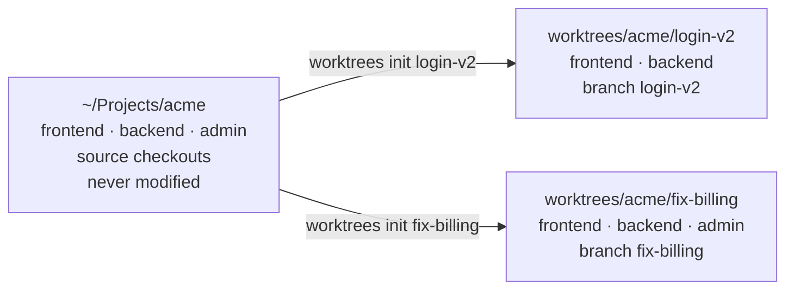
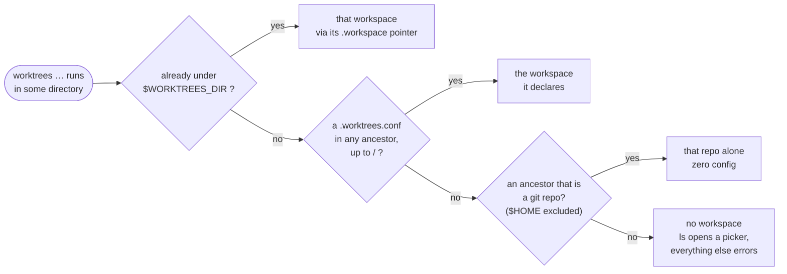
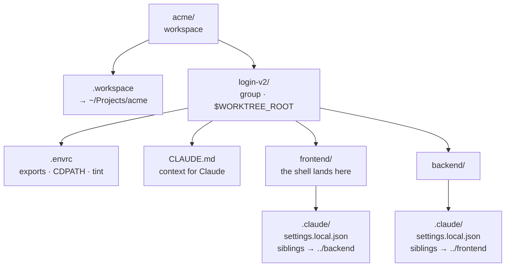
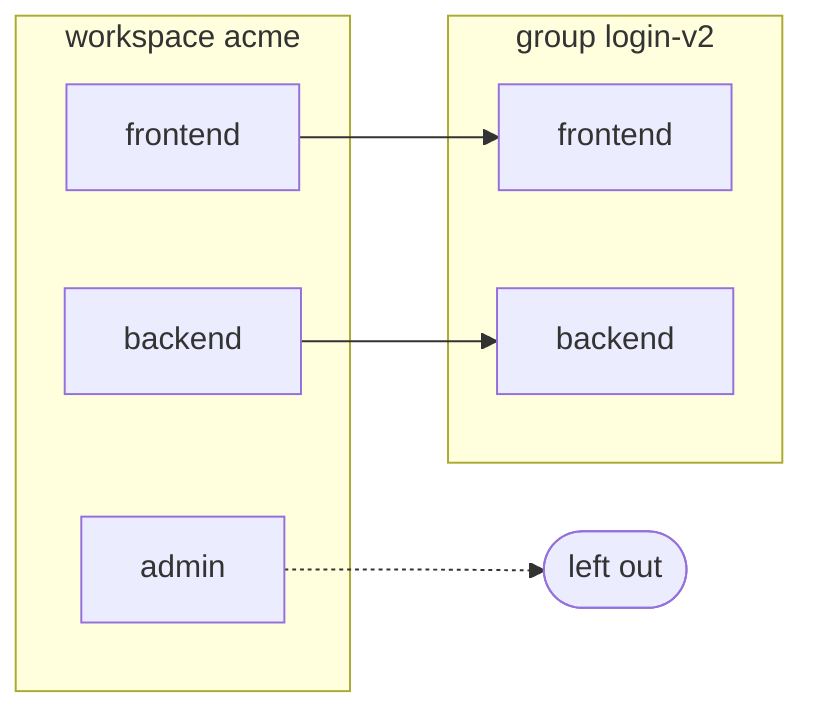
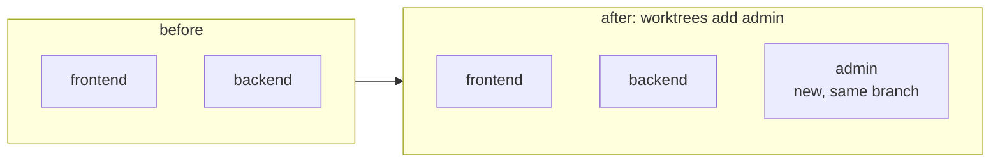
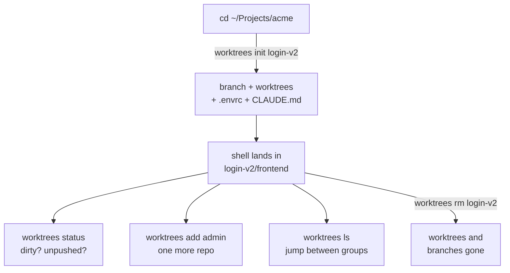
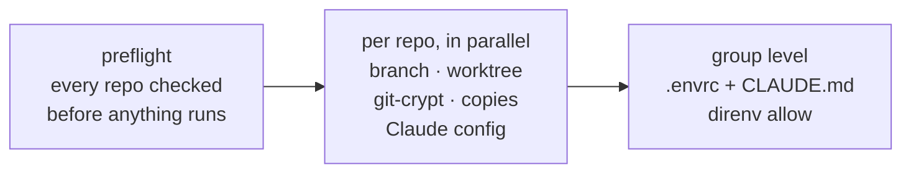
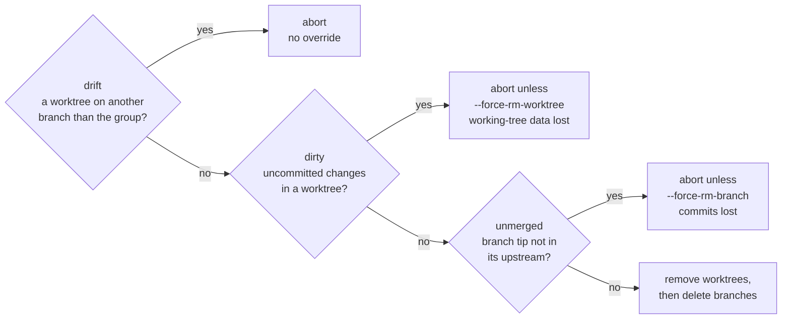

# worktrees

Spin up a coordinated set of Git worktrees across every repo a project spans,
with one command. Trying a feature, a bug repro, or a `tmp/` experiment
shouldn't mean clobbering your primary checkouts or juggling stashes.



Object stores are shared, so a group is cheap and instant.

## Three words

| term | what it is | example |
|---|---|---|
| **workspace** | a named set of repos that belong together | `acme` |
| **group** | one worktree instance of a workspace | `acme/login-v2` |
| **worktree** | one repo inside a group | `acme/login-v2/backend` |

## Which workspace am I in?

Derived from the current directory, so the same binary does the right thing in
every project:



So a single-repo project needs no setup at all:

```sh
cd ~/Projects/decoders
worktrees init fix-tuple-inference     # done
```

### Why the `.worktrees.conf` search finishes first

It runs as two full passes, not one interleaved walk. From
`~/Projects/acme/backend/src`:

| ancestor | pass 1 — `.worktrees.conf` | pass 2 — `.git` |
|---|---|---|
| `~/Projects/acme/backend/src` | – | – |
| `~/Projects/acme/backend` | – | ✓ *would* match |
| `~/Projects/acme` | ✓ **wins** | – |
| `~/Projects` … `/` | – | – |

Pass 1 runs to `/` before pass 2 starts. Interleaved, `backend` would match
first and collapse a three-repo workspace to one.

`$HOME` is excluded from the git-repo fallback: it's a dotfiles repo on plenty
of machines, and matching it would mean everywhere outside a real project
resolves to it. An explicit `.worktrees.conf` in `$HOME` still wins.

### The config file

Only `repos` is required. Put it at the directory that _contains_ the repos —
for a container dir like `~/Projects/acme/` that's outside every repo, so it
never gets committed anywhere.

```sh
# ~/Projects/acme/.worktrees.conf — sourced as bash

repos=(frontend backend admin)

# Subdirs to put on CDPATH inside a group, so `cd <something>` resolves to this
# group's worktree first. Order here is the desired final CDPATH order.
cdpath=("frontend/packages" "backend/apps" "frontend" "backend")

# Optional, with their defaults:
#   name=acme                       # dir under ~/Desktop/worktrees; default: basename of this dir
#   source_root=.                   # where the repos above live; default: this dir
#   default_base=origin/main        # default: whatever origin/HEAD points at
#   copy_patterns=(.env '.env.*' settings.local.json)
#   claude_md_template=path/to.md   # default: the tool's own template
```

`worktrees workspace` (alias `ws`) prints what got resolved; `--list` shows
every workspace that has groups on disk.

## Anatomy of a group



Each worktree also gets a one-line `.envrc` holding `source_up_if_exists`, so
the group's exports reach it.

Each worktree also gets a one-line `.envrc` holding `source_up_if_exists`, so
the group's exports reach it.

Desktop is the default home for groups so they're visible, easy to clean up,
and survive reboots. Override with `$WORKTREES_DIR`.

`.workspace` is a pointer, not a cache — repos and settings are always re-read
from the live config. It makes a group self-describing, so from anywhere under
`$WORKTREES_DIR` the tool can find its way back to the project, and `ls` can
enumerate workspaces without a registry. Two projects resolving to the same
name is caught on create; set an explicit `name=` in one of them.

## A group can cover a subset

You usually know up front which repos a feature touches. Leaving the rest out
keeps the group small:



The interactive create flow offers the same thing as a checkbox list.

**Nothing records that choice** — the directories on disk _are_ the record. No
manifest to drift, and widening the group later is just one more worktree:



## Lifecycle



## Usage

```
$ worktrees --help
Coordinated multi-repo git worktrees

Which repos a command acts on comes from the current directory:

  a dir holding .worktrees.conf  ->  the workspace it declares
  any other git repo             ->  a single-repo workspace, zero config

Groups live at /Users/nvie/Desktop/worktrees/<workspace>/<group>/<repo>

Usage:
  worktrees init <name> [<base>] [--repos a,b] [--fetch]       Create a worktree group (alias: create)
  worktrees add <repo>... [--group <name>] [--base <branch>]   Widen an existing group by more repos
  worktrees switch [<name>]                                    Switch to a group; no <name> → latest (alias: go)
  worktrees ls                                                 List groups (interactive picker on a TTY via the Fish wrapper)
  worktrees status [<name>]                                    List repos with local changes (alias: st)
  worktrees workspace [--list]                                 Show the resolved workspace, or list all (alias: ws)
  worktrees rm <name> [--force-rm-worktree] [--force-rm-branch]
                                                               Remove a group: worktree dirs + branches
  worktrees prune [--force-rm-branch]                          Finish removal of groups whose dirs are gone
```

### Creating a group

```sh
worktrees init <name> [<base-branch>] [--repos a,b] [--fetch]
```

- `<name>` — name of the group and of the branch to create
- `<base-branch>` — branch to fork from (default: see below)
- `--repos` — comma-separated subset of the workspace's repos

Examples:

```sh
worktrees init feature-xyz
worktrees init fix-cf-cold-start origin/release-1.5
worktrees init tmp --repos backend
```

The default base is the first of these that resolves: `$DEFAULT_BASE`,
`default_base=` from the workspace config, whatever `origin/HEAD` points at,
`origin/main` or `origin/master` if either exists, and finally the source
repo's current branch — so a local-only repo with no remote works too.

### What `init` does



- **Preflight** — does the base branch exist in every repo, and is the branch
  already checked out outside this group? Either one fails and nothing is
  written at all.
- **Per repo** — reuse branch `<name>` if it exists locally, else create it from
  the base; `git worktree add --no-checkout`; symlink the source's git-crypt
  key; copy `copy_patterns` matches; `git checkout HEAD -- .` so smudge filters
  run and git-crypt decrypts; write `.claude/settings.local.json`.
- **Group level** — `.envrc` and `CLAUDE.md` only if absent, so your tweaks
  survive; `direnv allow` only where content matches an already-trusted source.

`git fetch` runs first when `--fetch` is passed, or when no explicit base was
given — the default base has to be current or you'd branch from stale state.
Repos with no remote are skipped.

Worktrees belonging to _this_ group aren't a branch conflict; they're the
idempotent-skip case. **`init` is idempotent for the happy path**: re-running
skips repos already set up and sets up any that aren't. Re-running _without_
`--repos` on an existing group keeps to the repos it already has, so a repair
run can't silently widen it.

Recovery from a run that failed mid-flow is `rm -rf` the group dir (or just the
broken sub-repo dir) and re-run. That's the orphaned-admin-entry case, which
the tool handles by running `git worktree prune` in each source repo and
proceeding. The branch is reused if it exists, so no commits are lost.

### The `.envrc`

The generated `.envrc` is purely declarative — it exports the group's context,
tints the terminal, and rebuilds `CDPATH`:

```sh
export WORKTREE_GROUP="feature-xyz"
export WORKTREE_ROOT="$PWD"
export WORKTREE_WORKSPACE="acme"
export WORKTREE_WORKSPACE_ROOT="/Users/nvie/Projects/acme"

# OSC 11 terminal tint. Uncomment a different line to override.
#bg="#1a0d2e"   # purple
#bg="#0d1a2e"   # blue
…
bg="#2e0d1a"   # hashed from name
printf '\e]11;%s\a' "$bg" > /dev/tty

# Reset CDPATH, then rebuild: '.' first, group root, container subdirs.
# path_add prepends, so add in reverse order of desired final order.
export CDPATH=""
path_add CDPATH "$PWD"
path_add CDPATH "$PWD/backend"
path_add CDPATH "$PWD/frontend"
export CDPATH=".:$CDPATH"
```

What that buys you:

| from anywhere in the group | resolves to | via |
|---|---|---|
| `cd backend` | `$WORKTREE_ROOT/backend` | the group-root entry |
| `cd cloudflare` | `$WORKTREE_ROOT/backend/apps/cloudflare` | a `cdpath=` entry |

The source checkout never wins.

Entries are workspace-wide, not group-specific: ones for repos a group doesn't
cover simply never match, which is what keeps `worktrees add` from having to
rewrite the `.envrc`.

Everything else — `cd*` aliases, prompt chip, tint reset — is driven off those
env vars by the fish snippet. direnv unloads them when you `cd` out, so it all
flips back automatically.

## Per-repo bootstrap

`git worktree add` materializes **tracked** files only. Some of what it leaves
behind you want; some you very much don't.

| in the source repo | in a fresh worktree |
|---|---|
| tracked files | ✓ checked out by git |
| `.env`, `.env.local` — matches `copy_patterns` | ✓ copied |
| `.claude/settings.local.json` | ✓ copied, then `additionalDirectories` rewritten |
| git-crypt encrypted files | ✓ decrypt on checkout, via the symlinked key |
| `node_modules/`, `dist/`, `.DS_Store`, `*.tsbuildinfo` | ✗ skipped |

### git-crypt

When a source repo has `.git/git-crypt/` — i.e. git-crypt is initialized and
unlocked — the tool symlinks that directory into the worktree's git dir before
checkout:

```
<wt>/.git/worktrees/<name>/git-crypt → <source>/.git/git-crypt
```

The smudge filter then finds the source's key, encrypted files decrypt on
checkout, and any `.env`-type file that is itself git-crypt-encrypted comes
along for free — no copy needed. Repos without git-crypt are unaffected.

### Claude config

The goal: from inside any worktree of a group, a Claude session has write
access to **all sibling worktrees in that group** — and never to the source
checkouts.

1. **Group-level `CLAUDE.md`** at `<group>/CLAUDE.md`. Tells Claude in plain
   English that this is a worktree group, lists the group's repos, and
   instructs it to read any source-checkout paths in subordinate `CLAUDE.md`
   files as relative to this group. Claude walks up from the cwd to find it.

   Content lives in [`share/CLAUDE.md.template`](share/CLAUDE.md.template);
   `claude_md_template=` in the workspace config overrides it per project. The
   script substitutes `{{name}}`, `{{date}}`, `{{workspace}}`, `{{group_dir}}`,
   `{{source_root}}`, `{{count}}` and `{{repos}}` at create time.

2. **Per-worktree `.claude/settings.local.json`**. If the source repo has one,
   it travels via the copy step (your `permissions.allow` lists are preserved)
   and `jq` then replaces `permissions.additionalDirectories` with this group's
   sibling paths. If it doesn't, a fresh file is written with just those paths.
   The mutation runs on every create, so re-runs and `worktrees add` keep the
   list current.

`jq` is therefore a hard dependency.

A linked worktree's `info/exclude` is **not** worktree-local — git reads it
from `$GIT_COMMON_DIR`, shared with the source — so it can't be used to hide
`.claude/` from `git status`. Instead, the dirty check filters two things the
tool created itself:

- `?? .claude/`
- `?? .envrc`, but **only** while it's still exactly the one-line
  `source_up_if_exists` stub the tool writes. Add anything to it and it counts
  as your work again.

Without that filter, every worktree of a repo that doesn't already track those
files would read as permanently dirty, and `rm` would always demand
`--force-rm-worktree`.

### What gets copied

Every untracked or ignored path that `git status --ignored` reports in each
source repo is matched by **basename glob** against `copy_patterns`. Matches
are copied into the worktree at the same relative path; everything else is
silently skipped — `.DS_Store`, `node_modules`, `*.tsbuildinfo`, build dirs,
IDE state, the long tail.

Default:

```
.env, .env.*, settings.local.json
```

`settings.local.json` is in there so a source repo's existing
`.claude/settings.local.json` travels into the worktree before the Claude step
rewrites its `additionalDirectories`.

Matching is against the basename only, using a bash `case` block — so the
globs are shell globs, not regex, and a single `.env.*` entry catches
`.env.local` anywhere in the tree. Override with `copy_patterns=(...)` in the
workspace config.

## Installation

Two one-shot symlinks. No `config.fish` edits.

```sh
ln -s /path/to/worktrees/bin/worktrees          ~/bin/worktrees
ln -s /path/to/worktrees/share/worktrees.fish   ~/.config/fish/conf.d/worktrees.fish
```

`~/bin` is on your PATH, so `worktrees` becomes available globally. Fish
auto-sources every `*.fish` under `conf.d/`, so the snippet loads with no extra
config.

## Fish setup

`share/worktrees.fish` makes `cd*` aliases, the prompt chip, and the terminal
tint group-aware. It defines:

- **`wt_cd <rel-path>`** — takes a path relative to a group root (i.e. starting
  with a repo name) and routes it to `$WORKTREE_ROOT/<rel>` when you're in a
  group. Outside one it uses `$worktrees_source_root` if you've set it, else
  the source root of whatever workspace the cwd resolves to.

  Project-specific aliases should set the variable so they keep working from
  anywhere, including from `~`:

  ```fish
  set -gx worktrees_source_root ~/Projects/acme
  function cdbe;  wt_cd 'backend';                end
  function cdcf;  wt_cd 'backend/apps/cloudflare'; end
  ```

- **`--on-variable WORKTREE_GROUP` handler** — emits the OSC 11 reset
  (`\e]111\a`) when the group unsets. Entry-side tinting is emitted from the
  `.envrc` itself, because a fish event would race direnv's variable emit order.

- **`worktrees` function wrapper** — `switch`/`go` and `ls` `cd` you into the
  chosen group, and `init` `cd`s into the new one, so the `.envrc` loads
  without a second command. Everything else passes through.

  You land in the group's **first repo**, not the group root. The root isn't a
  repo, so `git` there reports whatever enclosing repo happens to exist — on a
  machine where `~` is a dotfiles repo, the prompt shows a branch with nothing
  to do with the group. The group's `.envrc` still loads from a repo below it,
  via the `source_up_if_exists` stub, so the exports and tint are unaffected.
  "First" means first in the workspace's `repos=()` order.

### Show the group in your prompt

```fish
if set -q WORKTREE_GROUP; and string match -q "$WORKTREE_ROOT/*" "$PWD"
    set -l rel (string replace -- "$WORKTREE_ROOT/" '' "$PWD")
    set -l display
    if string match -q '*/*' "$rel"
        set display (string replace -r '^[^/]+/' '' "$rel")
    else
        set display "$rel"
    end
    set_color bryellow
    printf '[worktree:%s]' "$WORKTREE_GROUP"
    set_color normal
    set_color $fish_color_cwd
    printf ' %s' "$display"
    set_color normal
else
    # … your usual cwd + git_prompt …
end
```

## Visual markers

- **Prompt** — `[worktree:<name>]` in bright yellow, followed by the path
  within the current repo.
- **Terminal background** — a subtle dark tint via OSC 11, reset on direnv
  unload.

Each group's color is picked from an 8-entry palette by hashing
`<workspace>/<group>`, so a name always looks the same, and the same feature
name in two workspaces doesn't collide. Don't like the color? Uncomment a
different `bg=` line in the group's `.envrc` — re-runs won't touch it.

## Other commands

`ls` has two faces. Through the Fish wrapper on a terminal it opens an
interactive picker: `↑/↓` to move, `⏎` to `cd` into a group (landing in its
first repo), `d` to remove one
(a confirm dialog whose checkboxes map to the `--force-rm-*` flags), `w` to
switch workspace, or drop onto the trailing row to create a new group — which
prompts for a name, a repo subset, and a base branch picked from every local
branch across the workspace's repos.

Started from somewhere that implies no workspace, the picker opens on the
workspace list instead of erroring.

When stdout isn't a terminal — `worktrees ls | fzf` — it falls back to printing
one group name per line on **stdout**. On **stderr** it emits a one-line
warning per group whose worktrees aren't all on the group's own branch:

```
warning: feature-xyz: 1 of 3 worktrees off-branch (backend→main)
```

Stdout stays clean, so `worktrees ls | fzf` never sees it. Triggers: someone
`git checkout`ed inside a worktree and forgot to switch back, a detached HEAD,
or an orphaned admin entry.

`status` (alias `st`) lists the repos in a group that need attention —
uncommitted changes, unpushed commits, or both — and exits 1 if any do.
Defaults to the group you're standing in.

`rm` is a two-step cleanup:

1. Remove the worktree dirs under the group and the corresponding
   `git worktree` admin entries in every source repo.
2. Delete the branches those worktrees were on.

Step 2 is **evidence-based**: a branch is only deleted if there's an admin
entry under this group pointing at it. `rm` never matches branches by name
alone — if you've already `rm -rf`'d the group dir by hand, the surviving admin
entries are what say which branches to clean.

Three safety gates, all checked **upfront across every repo** before anything
is touched:



The two `--force-*` flags are orthogonal; there is intentionally no umbrella
`--force`.

**`rm` is idempotent.** If some repos are healthy and others are half-removed,
re-running picks up where the last run left off:

| State          | Dir | Admin | Action                                  |
| -------------- | --- | ----- | --------------------------------------- |
| `HEALTHY`      | ✓   | ✓     | `git worktree remove` + `git branch -d` |
| `DIR_ONLY`     | ✓   | ✗     | `rm -rf` + skip branch (no evidence)    |
| `ORPHAN_ADMIN` | ✗   | ✓     | `git worktree prune` + `git branch -d`  |
| `GONE`         | ✗   | ✗     | nothing                                 |

`prune` is the deferred step 2: "I deleted a group's directory by hand, now
finish the cleanup". Before delegating to `git worktree prune` (which _destroys_
the path→branch evidence), it walks every source repo's admin entries, finds
the ones pointing at now-missing paths under this workspace, and for each group
whose dir is also gone deletes the linked branches. Then it prunes the entries.

It skips with a warning rather than aborting on drift in an orphan entry, and
on unmerged branches (pass `--force-rm-branch`). `--force-rm-worktree` is
accepted for flag-surface consistency but is a no-op there.

**Order matters.** `rm -rf <group>` followed by `worktrees prune` is a complete
cleanup, branches and all. But `rm -rf <group>` followed by a bare
`git worktree prune` destroys the evidence — the branches survive as orphans
reachable only by name match, which this tool deliberately won't do for you.

## Configuration

Per workspace, in `.worktrees.conf` — see [Workspaces](#workspaces) for the
full key list.

Global, via the environment:

- `WORKTREES_DIR` — where groups live (default `~/Desktop/worktrees`)
- `DEFAULT_BASE` — overrides the base branch for every workspace

At the top of the script:

- `PALETTE` — 8 dark background hex values for the OSC 11 tint.

  ```bash
  PALETTE=(
    "#1a0d2e purple"  "#0d1a2e blue"   "#0d1f0d green"  "#1f1a0d brown"
    "#2e0d1a plum"    "#1f1f0d olive"  "#2e1f0d amber"  "#0d2e1a teal"
  )
  ```

  Hash: `printf '%s' "<workspace>/<group>" | md5sum | head -c 2` → hex byte →
  mod 8 → index.

## Requirements

- [Claude Code](https://docs.claude.com/en/docs/claude-code) — the tool
  generates Claude-specific config; no fallback or alternative agent support
- [Fish shell](https://fishshell.com/)
- [Ghostty](https://ghostty.org/)
- [direnv](https://direnv.net/) (hooked into Fish)
- [`jq`](https://jqlang.org/)
- `md5sum` (coreutils)

## Roadmap

- **Generalize beyond fixed tools.** Drop the hard assumption of Fish +
  Ghostty + direnv. Support at least Bash/Zsh prompts, generic OSC 11 (or
  none), and graceful degradation based on what's actually installed.

## Non-goals

- Replacing or wrapping `git worktree` for general use. This is a workflow tool
  for _coordinated multi-repo_ worktrees, not a worktree manager.
- Syncing branches or commits between worktrees. Each worktree is just a normal
  checkout — push, pull, rebase as usual.
